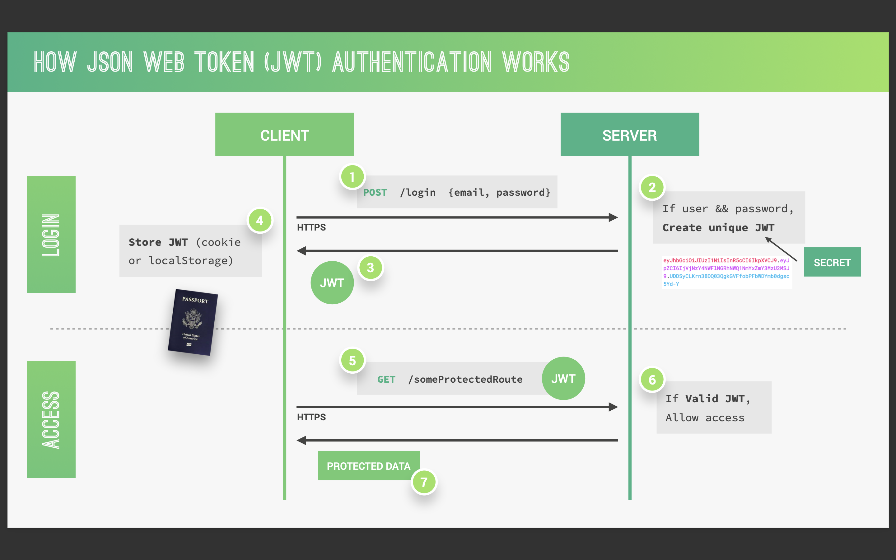
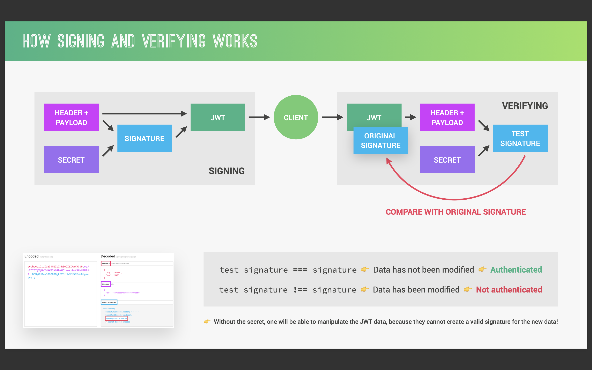

# nodejs-node
Nodejs学习笔记
## 1. Node.js介绍
### P1 学习建议
- 多敲代码
- 完成课后练习
- 记笔记
- 学习所有课程内容
### P2 安装Node.js
### P3～P4 什么是Nodejs  
Node.js是基于Google Chrome的V8 JavaScript引擎构建的，具有高性能和高效执行 Javascript的能力。Node.js使用了事件驱动、非阻塞I/O模型，适合用于开发高并发、数据密集型的实时应用。例如实时聊天、流媒体服务、协作工具。特点：
- 单线程与事件循环：通过事件循环处理多个并发请求，而不是为每个请求创建一个新的线程；
- 非阻塞I/O：Node.js的I/O是非阻塞的，即使在等待I/O完成时，也能处理其他任务；
- 丰富的生态系统：Node.js社区有大量的第三方模块，覆盖数据库连接、HTTP服务器、各种使用工具；
- 包管理器npm：Node Package Manager是最大的开源软件包库之一；
### P5 终端运行js代码
### P6 介绍Nodejs文档
### P7 fs文件系统-同步读写
- `fs.readFileSync(path[,options])`：同步读取文件；
- `fs.writeFileSync(path,data[,options])`：同步写入文件；
### P8 同步阻塞代码，异步不阻塞代码
### P9 fs文件系统-异步读写
- `fs.readFile(path[,options],callback)`：异步读取文件；
- `fs.writeFile(path,data[,options],callback)`：异步写入文件；
### P10 创建简单的web服务
- `http.createServer(callback)`：创建服务器，接收回调函数；
- `res.end(data)`：发送消息；
- `server.listen(port,[host],[callback])`：启动监听连接的服务器，接收端口、地址、回调函数；
### P11 route路由
Web应用程序用来处理HTTP请求的核心机制。定义了客户端发送请求时，服务器如何响应这些请求的逻辑。  
- `req.url`：获取当前用户访问路由页面。  
- `res.writeHead`：接收三个参数，状态码、可读的状态消息、`header`响应头。必须在`res.end`之前调用。
### P12 一个简单的API
### P13～14 农场DEMO
1. 读取文件template文件夹下`.html`文件，以字符串形式返回；
2. 遍历循环`data.json`中数据，通过字符串替换形式将替换`tempCard`的占位符。
3. 将`templateOver`文件下占位符用`tempCard`替换。
4. `res.end()`启动服务，看效果。
### P15 从URL中读取参数
引入`url`模块，版本原因，原视频中`url.parse`方法在我当前的v16.16版本已经废除，使用新语法`new URL`，可以不用引入`url`模块。  

在使用过程中获取`req.protocol`是意外发现是undefined，目前还未找出原因。初步猜测是因为本地服务。文档中表明：
> 分配给 protocol 属性的无效的网址协议值将被忽略.  

最后继续使用字符串替换的方法，将找到的`data[id]`替换`templateProduct`中的占位符。
### P16 使用module.exports
将`replaceTemplate()`封装成公用方法，通过modules.exports导出。
### P17 npm介绍
### P18 dependencies 和 devDependencies
项目依赖和开发依赖的区别，默认安装是项目依赖，--save-dev安装开发依赖。  

如何使用项目中安装的开发依赖，例如nodemon。

### P19 如何引入、使用第三方包
### P20 依赖包版本和更新
`npm outdated`：检查当前项目包版本是否落后；

`package.json`：项目清单。官方介绍：
> https://dev.nodejs.cn/learn/the-package-json-guide/

软件包版本：所有版本都有3个数字，第一个是主版本，第二个是次版本，第三个是补丁版本。
- `~3.1.0`：表示安装`3.1.x`最新版本，单不更新主版本号、次版本号。
- `^3.1.0`：表示安装`3.x.x`最新版本，但不更新主版本号。
- `*3.1.0`：表示安装最新版本，更新主版本号。

`package.json`：跟踪被安装的每个软件包的确切版本，以便产品可以以完全相同的方式被复制。

### P21 VScode配置
prettier 格式化文档

## 2. 网络基础（前后端通信）
### P24 加载web页面都做了哪些事情


### P25 HTTP请求

### P26 前后端对比

### P27 静态页面 动态页面
通过`API`请求

## 3. Node.js原理（理论知识、核心内容）
### P29 Node、chrome V8、Libuv、C++
`Node.js`是基于`chreom V8`和`Libuv`进行封装的一层。

### P30 进程、线程和线程池
`Node.js`单线程。程序初始化时顶层代码会执行，注册必须的模块，然后事件循环开始运行。有些时间太耗时，将会被放入线程池中(图中举例哪种任务是繁重的)。


### P31～32 EventLoop
`process.env.UV_THREADPOOL_SIZE`设置线程池数量，通常默认是4个。

`process.nextTick`回调添加到`process.nextTick.queue`,`Promise.then()`回调添加到`promise microtask queue`。`setTimeout`、`setImmediate`添加到`macrotask queue`中。  

事件循环先执行`process.nextTick queue`中的任务，然后执行`Promise microtask queue`，再执行`macrotask queue`。

#### 参考
- [NodeJs中的事件循环--理解同步于异步编程](https://www.freecodecamp.org/chinese/news/nodejs-eventloop-tutorial/)
- [EventLoop、Timers、Process.nextTick官方文档](https://nodejs.org/en/docs/guides/event-loop-timers-and-nexttick/)
- [EventLoop练习题](https://juejin.cn/post/6844904077537574919)

### P33～34 事件和事件驱动架构
`Node.js`核心API都是围绕异步事件驱动架构构建的，在该架构中，某些类型的对象（“触发器”）触发命名事件。  
所有触发事件的对象都是`EventEmitter`类的实例。这些对象暴露了`eventEmitter.on()`函数，允许将一个或多个函数绑定到对象触发的命名事件。

### P35～36 stream 流


stream类型：
- 可读流：可供读取的数据流，例如http请求、fs读取文件流。
- 可写流：可供写入的数据流，例如http相应、fs写入文件流。
- 双工流：
- 转换流：

读取文件的方式：
- fs.readFile()：缓冲整个文件，如果读取文件大会占用较多内存。
- fs.createReadStream()：on|end，通过将文件拆分成一小块一小块读取，最后读取结束后返回。（从直观效果上来说，我并不觉得和上一种方式有什么区别）。
- fs.createReadStream()：pipe管道方式.

按照作者视频上的讲解，应该第三种方式会很快展示出来，但令我意外的是，无论哪种方式我的电脑都崩溃了😅。

### P37～38 模块引入是如何工作的

每个JS文件都被当成一个单独的模块，NodeJS中使用CommonJS Module导入方式，浏览器中使用ES Module导入方式。也有尝试将ES Module引入到NodeJS中，但不是主流方式。  

当引入一个模块是会发生如下步骤：
#### 解析和加载


  模块被分为三种类型：核心模块，开发者封装模块，第三方引入模块（npm）。
  1. 首先会判断是否为核心模块；
  2. 如果是以./或者../开头的路径，则会尝试去开发者封装的模块下查找；
  3. 如果没找到，会找当前文件夹中的index.js文件；
  4. 如果都不是则会去`node_modules`中查找第三方模块。
 
#### 封装

运行JS文件时，Nodejs会将文件先放入到一个自执行匿名函数（立即执行函数）中，该函数中有五个参数：  

- exports：需要导出的对象；
- require：导入的模块；
- module：
- __fileName：文件名；
- __dirname：目录名；

`console.log(require('module').wrapper)`打印NodeJs用来封装单文件的函数。

#### 执行

#### 返回要导出内容


1. `require`函数返回引入模块中导出的内容;
2. 使用`module.exports`仅可以返回一个对象；
3. 使用`exports`可以返回多个命名变量；

#### 缓存
当导入模块第一次执行后，会被缓存，下次再使用时从缓存中读取。
 
## Promise、Async/Await
### P41 回调嵌套回调所引起的问题
回调地狱

### P42～43 Promise
一个`Promise`是一个代理，代表一个在创建`promise`时不一定已知的值。允许将处理程序与异步操作的最终成功值和失败原因关联起来。使得异步方法可以像同步方法一样返回值：异步方法不会立即返回一个最终值，而是返回一个promise，以便在将来的某个时间点提供值。

```js
const readFilePromise = (path) => {
  new Promise((resolve, reject) => {
    readFile(path, (error, result) => {
      if(err) {
        reject(error)
      } else {
        resolve(result)
      }
    })
  })
}

readFilePromise('./data.txt')
  .then((res) => console.log(res))
  .catch((err) => console.error('读取文件失败'))
```

### P43～44 Async\Await
使用`async`和`await`关键字更简洁写出基于`Promise`的异步行为，无需刻意地链式调用`promise`

返回一个`Promise`  

`async`函数可能包含0个或多个`await`表达式。`await`表达式会暂停整个`async`函数的执行进程并出让其控制权。只有当其等待的基于`promise`的异步函数操作被兑现或被拒绝后才会恢复进程。  
`promise`的解决值会被当作该`await`表达式的返回值。

### P45 Promise.all
`Promise.all()`静态方法接受一个Promise可迭代对象，返回一个`Promise`。当所有输入的`Promise`都被对象，返回的`Promise`也将被兑现，并返回一个包含所有兑现值的数组。  
如果输入的任何`Promise`被拒绝，则返回的`Promise`将被拒绝，并带有第一个被拒绝的原因。

## Express
### P47 Express介绍
Express是一个基于Node.js的web应用框架，使用了Connect（中间框架）作为基础，简化了构建Restful API和Web服务器的过程。特征：  
- 中间件系统：Express使用中间件模式处理请求。中间件是一个函数，可以访问请求对象（req）、响应对象（res）和应用程序中的下一个中间件函数。可用于日志记录、身份验证、请求处理等，串联起来形成处理链；
- 路由控制：轻松处理不同URL路径的函数。例如`app.get()`、`app.post()`;
- 视图系统：支持多种模板引擎，如EJS、Pug、Handlebars等，用于渲染HTML页面；
- 静态服务文件：通过使用`express.static()`中间件提供静态文件；
- 错误处理：Express提供错误处理中间件，用于处理错误。
### P48 安装Postman
### P49 创建Express和路由
1. 初始化项目：`npm init -y`；
2. 安装express：`npm install express`；
3. 创建一个Express应用：`const express = require('express')`；
4. 创建两个接口：`app.get('/')`、`app.post('/')`；
5. 通过Postman测试路由；
### P50 API、RESTful API
API（Application Programming Interface）一组预先定义的规则、协议和工具用于构建软件应用程序。类型：
- Web API 或 HTTP API：使用HTTP协议进行通信，常用于Web服务，如RESTful API，通过HTTP方法（GET、POST、PUT、DELETE）来操作资源；
- 库或框架API：编程语言的一部分，允许开发者使用库或者框架提供的功能，如JQuery；
- 操作系统API：允许开发者访问操作系统级别的功能，如文件系统、硬件控制；
- 数据库API：允许应用程序与数据库交互；
- 图形用户界面（GUI）API：构建图形界面；
- 消息队列API：用于进程痛惜

RESTful API特点：
- 资源导向（Resource-Oriented）：RESTful API中的每个组件都是一个资源，资源通过URI来唯一标识；
- 统一接口（Uniform Interface）：利用HTTP方法（GET、POST、PUT、DELETE）来操作资源；
- 无状态（Stateless）：服务器不存储关于客户端的上下文信息，每次请求都包含处理该请求所需的信息，有利于可伸缩性和简单性。
### P51 查询所有Tours
```javascript
app.get('/api/v1/tours', (req, res) => {
  res.status(200).json({ status: 'success', data: { tours }})
})
```
### P52 添加一个Tour
```javascript
app.post('/api/v1/tours', (req, res) => {
  const newId = tours[tours.length - 1].id + 1;
  const newTour = Object.assign({id: newId}, req.body)
  tours.push(newTour)
  res.status(201).json({status: 'success', data: { tour: newTour }})
})
```
### P53 响应URL中的参数
```javascript
app.get('/api/v1/tours/:id', (req, res) => {
  const id = req.params.id * 1;
  const tour = tours.find((el) => el.id === id)

  if(!tour) {
    res.status(404).json({status: 'fail', message: 'Invalid ID'})
  }
  res.status(200).json({status: 'success', data: { tour }})
})
```
### P54 修改Tour
```javascript
app.patch('/api/v1/tours/:id', (req, res) => {...})
```
### P55 删除Tour
```javascript
app.delete('/api/v1/tours/:id', (req, res) => {...})
```
### P56 重构路由
```javascript
app.route('/api/v1/tours').get(getAllTours).post(createTour)
app.route('/api/v1/tours/:id').get(getTour).patch(updateTour).delete(deleteTour)
```
### P57 MiddleWare 和 Request-Response Cycle
中间件函数按照定义的顺序执行，每个中间件都有4个参数：访问请求对象`req`、响应对象`res`、指向下一个中间件的`next`函数。


### P58 创建一个MiddleWare
```javascript
app.use((req, res, next) => {
  req.requestTime = new Date().toISOString()
  next()
})
```
### P59 引用第三方中间件morgan
morgan用于记录HTTP请求的详细信息。
### P60 创建用户路由
```javascript
app.route('/api/v1/users').get(getAllUsers).post(createUser)
app.route('/api/v1/users/:id').get(getUser).patch(updateUser).delete(deleteUser)
```
### P61 express.Router()
```javascript
const tourRouter = express.Router();

const getAllTours = (req, res) => { ... };
const createTour = (req, res) => { ... };
const getTour = (req, res) => { ... };
const updateTour = (req, res) => { ... };
const deleteTour = (req, res) => { ... };

tourRouter.route('/').get(getAllTours).post(createTour);
tourRouter.route('/:id').get(getTour).patch(updateTour).delete(deleteTour);

app.use('/api/v1/tours', tourRouter)
```
### P62 划分文件目录
- public：静态文件，如CSS、JS、图片等；
- routes：路由文件；
- controllers：控制器文件，处理业务逻辑；
- models：模型文件，定义数据模型；
- config: 配置文件，如数据库连接信息、环境变量配置；
- app.js：主应用文件，初始化Express应用，引入路由文件；
- server.js：服务器文件，启动Express应用；
- package.json：项目配置文件，包括依赖包、脚本等；
- package-lock.json：锁定依赖包版本，避免版本冲突；
### P63 router.param
`router.param()`用于定义参数化路由的中间件。当请求匹配到一个带有参数的路由时，`router.param()`中定义的中间件会在对应的参数值被解析之后执行。
```javascript
router.param('id', (req, res, next, val) => {
  // 判断是否为有效Id
  ...
  next()
})
```
### P64 链接多个中间件方法
`router.METHOD(path, middleware, ...)`可以传一个或多个中间件，这些中间件会依次执行。
```javascript
router.route('/').get(getAllTours).post(checkBody, createTour)
```
### P65 express.static()中间件
`express.static()`用于提供静态文件服务，如HTML、CSS、图片等。重要选项：
- 路径：可以指定一个或多个文件夹路径；
  ```javascript
  app.use(express.static('/public'));
  app.use(express.static('uploads'));
  ```
- 缓存：默认Express会缓存静态文件的元数据，以提高性能。可以通过`maxAge`选项来控制缓存时间，单位事毫秒或者字符串
  ```javascript
  app.use(express.static('public', { maxAge: '1h' }))
  ```
- 隐藏文件：通过设置`dotfiles: 'allow'`来允许显示隐藏文件；
- 重定向：通过设置`redirect: true`来重定向到指定路径；
- ...
### P66 环境变量
`dotenv`中间件用于读取`.env`文件，并设置环境变量。`
### P67 配置eslint
```terminal
npm install eslint prettier eslint-config-prettier eslint-plugin-prettier eslint-config-airbnb eslint-plugin-node eslint-plugin-import eslint-plugin-jsx-a11y eslint-plugin-react --save-dev
```
## Mongodb
### P69 MongoDB简介
MongoDB是一个开源的、基于分布式文件存储的NoSQL数据库系统，提供高可用性、高扩展性和高性能的数据库存储解决方案。尤其适合大规模的半结构化和非结构化数据。MongoDB使用BSON（Binary JSON）数据格式，一种类似于JSON的二进制表示，能够存储复杂的数据结构，如数组、对象。特性：
- 文档数据库：数据以键值对的形式存储，通常以BSON或JSON格式；
- 横向扩展：支持水平扩展，通过分片可以在多台机器上分布数据，以处理大量数据和高并发场景；
- ...
### P72 创建本地数据库
1. 连接到MongoDB，终端输入`mongosh`
2. `use natours-test` 创建数据库
3. `db.collection.insertOne()` 插入一条数据
4. `db.collection.find()` 查看数据
5. `show dbs` 展示所有数据库，数据下面必须有集合才能找到
6. `show collections` 展示数据库下面的集合
7. 切换数据库`use admin`
8. 退出`quit()`
### P73 创建集合
`db.collection.insertMany()`插入多条数据`
### P74 数据库查询
- `db.collection.find()`查看当前集合所有数据；
- `db.collection.find({ name: 'The Forest Hiker'} )`查询名称为The Forest Hilker的数据；
- `db.collection.find({ price: {$lte: 500} } )`查询价格小于等于500的数据；
- `db.collection.find({ price: {$lt: 500}}, {rating: {$gte: 4.8}} )`查询价格小于500，评分大于等于4.8数据；
- `db.collection.find({ $or: [{price:{$lt: 500}}, {rating: {$gte: 4.8}}] })`查询价格小于500或评分大于等于4.8的数据
- `db.collection.find({ $or: [{price:{$gt: 500} }, {rating:{$gte: 4.8}}, {name: 1}] })`查询价格小于500，评分大于4.8的数据。只返回名称
### P75 数据库更新
- `db.collection.updateOne({ price:{$gt:500}, rating:{$gte:4.8} }, {$set: {premium: true}} )`更新一条数据
- `db.collection.updateMany`更新多条数据
- `db.collection.update({name: 'The Snow Adventurer'}, {$unset: {premium: null}})`移除某条数据属性
### P76 数据库删除
`db.collection.deleteMany()`
### P77 使用Compass增删改查数据
### P78 创建一个托管在Atlas的数据库
MongoDB Atlas是MongoDB公司提供的云托管服务，允许用户在云端轻松部署、管理和扩展MongoDB数据库。
### P79 连接到托管在Atlas的数据库
点击`Database Access`菜单，选择User，拿到password。
## Mongoose
### P81 Express项目中连接到Mongoose
```javascript
const mongoose = require('mongoose');

const DB = process.env.DATABASE.replace('<password>', process.env.DATABASE_PASSWORD)

mongoose.connect(DB).then((con) => {
  console.log('DB connection successful!')
})
```
### P82 Mongoose介绍
Mongoose是Node.js中用于操作MongoDB数据库的一个流行库，提供了模型(models)、验证(validation)、查询构建器(query builder)等功能。
### P83 创建Tour Model
mongoose.Schema是用来定义数据结构的类，是Mongoose模型的基础。Schema允许定义文档的字段类型、验证规则、索引等。  
mongoose.model()函数用于根据给定的Schema创建一个Model模型。模型是Mongoose的核心概念，代表MongoDB集合(collection)中的文档(document)。模型提供了操作数据库的接口，包括CRUD。

`mongoose.model(name, Schema, [collection], [skipInit])`参数说明：
- name：模型的名称，也是在MongoDB中的集合名称；
- schema：一个Mongoose Schema对象，定义了模型的数据结构和验证规则；
- collection：集合的名称；
- skipInit：是否跳过初始化，默认为false。
```javascript
const tourSchema = new mongoose.Schema({
  name: { type: String, required: [true, 'A tour name is required!'], unique: true },
  rating: { type: Number, default: 4.5 },
  price: { type: Number, required: [true, 'A tour price is required!']}
})

const Tour = mongoose.model('Tour', tourSchema);
```
### P84 测试Model
```javascript
const tour = new Tour({ name: 'The Forest Hiker', price: 497, rating: 4.7 })
tour.save()
  .then(doc => {...})
  .catch(err => {...})
```
### P85 MVC介绍
- Model（模型）：
  - 数据管理：模型层负责封装应用程序的数据以及对数据的逻辑处理，包括存取、修改、验证等操作；
  - 业务逻辑：定义了应用程序的核心功能和数据处理流程，独立于用户界面和用户交互；
- View（视图）：视图负责展示模型中的数据给用户；
- Controller（控制器）：
  - 用户输入处理：处理接收用户的输入或请求，解析这些输入并决定如何处理；
  - 协作者：是Model和View之间的桥梁，根据用户操作调用Model来处理数据，选择合适的View展示处理后的结果。
### P86 重构目录
### P87 model.create()
`model.create()`方法用于创建并保存一个新的文档到对应的MongoDB集合中。可以接受一个对象或者数组，该对象或数组的属性与模型的Schema匹配。
```javascript
exports.createTour = async (req, res) => {
  try {
    const newTour = await Tour.create(req.body)
    res.status(201).json({ message: 'success', data: { tour: newTour }})
  } catch (err) {
    res.status(400).json({ message: 'failed', message: 'Invalid data' })
  }
}
```
### P88 model.find()
- `model.find()`方法用于从MongoDB集合中查找匹配特定条件的文档，返回一个文档数组，可以链式调用其他查询方法；
- `model.findById()`方法用于根据指定的_id字段查找单个文档；
- `model.findOne`用于找匹配特定条件的第一条文档，返回一个文档。
```javascript
exports.getAllTours = async (req, res) => {
  try {
    const tours = await Tour.find();
    res.status(200).json({ status: 'success', data: { tours } })
  } catch (err) {
    res.status(404).json({ status: 'fail', message: err })
  }
}

exports.getTour = async (req, res) => {
  try {
    const tour = await Tour.findById(req.params.id)
     // Tour.findOne({ _id: req.params.id })
    res.status(200).json({ status: 'success', data: {tour} })
  } catch (err) {
    res.status(404).json({ status: 'fail', message: err })
  }
}
```
### P89 model.findByIdAndUpdate()
`model.findByIdAndUpdate()`方法找到并更新匹配特定条件的第一个文档；
```javascript
exports.updateTour = async (req, res) => {
  try {
    const tour = await Tour.findByIdAndUpdate(req.params.id, req.body, {
      new: true,
      runValidators: true
    })
    res.status(200).json({status: 'success', data: { tour }})
  } catch (err) {
    res.status(404).json({ status: 'fail', message: err })
  }
}
```
### P90 model.findByIdAndDelete()
`model.findByIdAndDelete()`方法用于删除指定Id文档。
```javascript
exports.deleteTour = async (req, res) => {
  try {
    await Tour.findByIdAndDelete(req.params.id)
    res.status(200).json({ status: 'success' })
  } catch (err) {
    res.status(404).json({ status: 'fail', message: err })
  }
}
```
### P91 Tour Model完善
```javascript
const tourSchema = new mongoose.Schema({
  name: {
    type: String,
    required: [true, 'A tour name is required!']
    unique: true, // 唯一性校验
    trim: true, // 去除空格
  },
  duration: {
    type: Number,
    required: [true, 'A tour duration is required!']
  },
  maxGroupSize: {
    type: Number,
    required: [true, 'A tour maxGroupSize is required!']
  }
  difficulty: {
    type: String,
    reuqired: [true, 'A tour difficulty is required!']
  }
  ratingsAverage: {
    type: Number,
    default: 4.5,
  }
  reatingsQuantity: {
    type: Number,
    dafault: 0,
  }
  price: {
    type: Number,
    required: [true, 'A tour price is required!']
  },
  summary: {
    type: String,
    trim: true,
    required: [true, 'A tour summary is required!']
  }
  description: {
    type: String,
    trim: true,
  }
  imageCover: {
    type: String,
    required: [true, 'A tour imageCover is required!']
  }
  images: [String], // 字符串数组
  createdAt: {
    type: Date,
    default: Date.now(), // 默认当前时间
  }
  startDates: [Date]
})
```
### P92 导入数据
```javascript
// import-dev-data.js
const fs = require('fs');
const mongoose = require('mongoose')
const Tour = require('./../models/tourModel')


const DB = process.env.DATABASE.replace('<PASSWORD>', process.env.DATABASE_PASSWORD)
mongoose.connect(DB).then(() => {
  console.log('连接成功')
})

const tours = JSON.parse(fs.readFileSync(`${__dirname}/dev-data/data/tours-simple.json`, 'utf-8'))
const importData = async () => {
  try {
    const tours = await Tour.create(tours);
  } catch (err) {
    console.log(err)
  }
  process.exit()
}

const deleteData = async () => {
  await Tour.deleteMany()
  try {
    ...
  } catch (err) {
    ...
  }
  process.exit()
}

if(process.argv[2] === 'import') {
  importData()
} else if(process.argv[2] === 'delete') {
  deleteData()
}
```

process是Node.js中的一个全局对象，提供了与Node.js进程相关的信息。通过该对象允许访问和控制Node.js进程，例如环境变量、监听进程事件、终止进程。  

属性:
- process.pid: 进程ID；
- process.version: Node.js版本号；
- process.argv: 命令行参数，数组形式；
- process.env: 环境变量，对象形式；
- process.platform: 操作系统平台,例如'win32'、'linux'；
- process.cwd: 当前工作目录；

方法:
- process.exit(code): 退出进程，code为退出码；
- process.nextTick(callback): 将回调函数添加到事件循环队列的尾部，并立即执行。
- process.on(event, callback): 监听事件，当事件触发时执行回调函数。
- process.kill(pid, [signal]): 结束指定进程
### P93 ~ 97 filter、sort、select、limit、skip
- `query.skip()`方法用于在查询中跳过指定数量的文档；
```javascript
exports.getAllTours = async (req, res) => {
  // filter
  const queryObj = { ...req.query }
  const excludedFiles = ['page', 'limit', 'sort', 'fields']
  excludedFiles.forEach(el => delete queryObj[el])

  // advanced filtering
  let queryStr = JSON.stringify(queryObj)
  queryStr = queryStr.replace(/\b(gte|gt|lte|lt)\b/g, match => `$${match}`)
  const query = Tour.find(JSON.parse(queryStr))

  // sort
  if(req.query.sort) {
    const sortBy = req.query.sort.split(',').join(' ')
    query = query.sort(sortBy)
  } else {
    query = query.sort('-createdAt') // 默认按照创建时间排序
  }

  // select 
  if(req.query.fields) {
    const fields = req.query.fields.split(',').join(' ');
    query = query.select(fields)
  } else {
    query = query.select('-__v')
  }

  // pagination
  const page = req.query.page * 1 || 1
  const limit = req.query.limit * 1 || 100
  const skip = (page - 1) * limit
  query = query.skip(skip).limit(limit)

  if(req.query.page) {
    const numTours = await Tour.countDocuments()
    if(skip > numTours) throw new Error('This page does not exist!')
  }

  const tours = await query
  ...
}
```
### P98 查询最便宜的五个旅游
```javascript
// tourController.js
exports.aliasTopTour = (req, res, next) => {
  const limit = 5;
  const sort = '-ratingsAverage,price', // 综合评分从高到低，价格从低到高
  const select = 'name,price,ratingsAverage,summary,difficulty'
  next()
}

// tourModel.js
router.route('/top-5-cheap').get(aliasTopTour, getAllTours)
```
### P99 封装逻辑
### P100 Aggregation Pipeline聚合管道
`Aggregation Pipeline`是一个用于处理数据记录的框架，允许对数据库中的数据进行一系列处理步骤。在管道中，数据从一个阶段流入下一个阶段，每个阶段可以对数据进行过滤、转换、组合、分析等操作。常见的聚合操作步骤：
- $match：筛选文档，符合条件的文档通过；
- $group：将文档分组，可以计算每个组的统计值；
- $sort：对文档进行排序;
- $skip：跳过指定数量文档
- $limit：限制返回的文档数量；
- ...

```javascript
// 查询评价分大于等于4.5的文档，按照【困难程度】分组，返回分组后的平均分、平局价格、最低价、最高价
const getTopTours = async (req, res) => {
  try {
    const stats = await Tour.aggregate([
      { $match: { $ratingsAverage: { $gte: 4.5 } }},
      {
        $group: {
          _id: { $toUpperCase: '$difficulty' },
          averageRating: { $avg: '$ratingsAverage'},
          averagePrice: { $avg: '$price' },
          minPrice: { $min: '$price' },
          maxPrice: { $max: '$price' }
        },
      }
      { $sort: { averageRating: -1 } }
    ])
  } catch (err) {
    ...
  }
}
```
### P101 查询一年当中最忙的六个月份
```javascript
exports.getMountlyPlan = catchAsync(async (req, res, next) => {
  const year = req.params.year * 1;

  const plan = await Tour.aggregate([
    { $unwind: '$startDates' }, // 解构startDates字段
    // 查询日期在21-01-01 12-31之间的数据
    {
      $match: {
        startDates: {
          $gte: new Date(`${year}-01-01`),
          $lte: new Date(`${year}-12-31`),
        },
      },
    },
    // 按照月份分组，统计每个月有多少活动，以及他们的名字分别是什么
    {
      $group: {
        _id: { $month: '$startDates' },
        numTourStarts: { $sum: 1 },
        tours: { $push: '$name' },
      },
    },
    // 添加字段
    { $addFields: { month: '$_id' } },
    // 移除字段
    { $project: { _id: 0 } },
    // 按照数量降序排列
    { $sort: { numTourStarts: -1 } },
    // 限制返回个数
    { $limit: 12 },
  ]);

  res.status(200).json({
    status: 'success',
    data: {
      plan,
    },
  });
});
```
### P102 Virtual Properties 虚拟属性
virtual properties用于创建虚拟字段，这些字段不存储在数据库中，但可以在查询结果中展示。通常用于计算、组合和格式化数据，以便在应用程序中使用。  
### P103 Document Middleware 文档中间件
document middleware是在**文档保存**`save()`或创建`create()`之前或之后执行自定义逻辑。
- `schema.pre()`方法用于注册预中间件，在指定操作之前运行的中间件。
```javascript
// 保存文档之前执行的逻辑
tourSchema.pre('save', function(next) {
  // ...
  next();
})
```
- `schema.post()`方法用于注册后中间件，在指定操作执行之后运行的中间件。
```javascript
// 保存文档之后执行的逻辑
tourSchema.post('save', function(next) {
  // ...
})
```
### P104 Query Middleware 查询中间件
query middleware是在**查询**执行之前或之后执行自定义逻辑。
```javascript
// pre 查询不是VIP的旅游
tourSchema.pre(/^find/, function(next) {
  this.find({ secretTour: { $ne: true } })

  this.startData = Date.now()
  next()
})

// post
tourSchema.post(/^post/, function(doc, next) {
  console.log(`Query took ${Date.now() - this.startData} milliseconds`)
})
```
### P105 Aggregation Middleware 聚合管道中间件
`Aggregate pipline()`方法允许访问将要发送给MongoDB的`aggregation pipline`。
```javascript
tourSchema.pre('aggregate', function(next) {
  console.log(this.pipline)

  this.pipline.unshift({ $match: { serectTour: { $ne: true } } } })
})
```
### P106 内置数据校验
[mongoose官方文档：内置校验规则](https://mongoosejs.com/docs/validation.html#built-in-validators)  
- required：必填
- type：字段值类型
- max、min：最大、最小值
- enum：枚举值
### P107 自定义校验规则
[mongoose官方文档：自定义校验规则](https://mongoosejs.com/docs/validation.html#custom-validators)
## Error Handling 错误处理
### P109 ndb debugger
### P110  处理未定义的请求
```javascript
app.all('*', (req, res, next) => {
  res.status(404).json({ status:'fail', message: `Can't find ${req.originalUrl} on this server!` })
})
```
### P111 错误处理介绍
针对操作错误
### P112 ～ 113 错误处理中间件
[express官方文档：错误处理中间件](https://express.nodejs.cn/en/guide/using-middleware.html#middleware.error-handling)
Express 有默认的错误处理程序，如果是同步代码抛出问题，自动捕获。如果是中间件，通过next传出err会进入错误处理中间件。
```javascript
// errorController.js
app.use((err, req, res, next) => {
  err.statusCode = err.statusCode || 500
  err.status = err.status || 'error'

  res.status(err.statusCode).json({ status: err.status, message: err.mesage })
})

// appError 
class AppError extends Error {
  constructor(message, statusCode) {
    super(message)

    this.statusCode = statusCode
    this.status = `${statusCode}`.startsWith('4') ? 'fail' : 'error'

    Error.captureStackTrace(this, this.constructor)
  }
}
```
### P114 
### P115 404错误处理
找不到数据时返回404错误
```javascript
// tourController.js
if(!tour) {
  return next(new AppError('No tour found with that ID', 404))
}
```
### P116 区分生产环境和开发环境错误处理
```javascript
const sendErrorProd = (err, res) => {
  // 操作错误返回具体信息
  if(err.isOperational) {
    res.status(err.statusCode).json({
      status: err.status,
      message: err.message
    }
  } else {
    // 第三方库返回未知错误信息
    console.error('ERROR 💥', err)
    res.status(500).json({
      status: 'error',
      message: 'Something went very wrong!'
    })
  }
}

const sendErrorDev = (err, res) => {
  res.status(err.statusCode).json({
    status: err.status,
    message: err.message,
    stack: err.stack,
    error: err
  })
}

module.exports = (err, req, res, next) => {
  ...
  if(process.end.NODE_ENV === 'development') {
    sendErrorDev(err, res)
  } else if (process.end.NODE_ENV === 'production') {
    sendErrorProd(err, res)
  }
}
```

### P117 ~ 118 处理无效ID、重复字段、mongoose中validation的错误
```javascript
// 处理查询数据异常情况，mongoose返回CastError
const handleCastErrorDB = (err) => {
  const message = `Invalid ${err.path}: ${err.value}`;
  return new AppError(message, 400);
};

// 处理添加重复字段问题，mongodb返回code为11000
const handleDuplicateFieldsDB = (err) => {
  const value = err.keyValue.name;
  const message = `Duplicate field value: ${value}. Please use another value!`;
  return new AppError(message, 400);
};

// 处理mongoose校验错误，mongoose返回ValidationError
const handleValidationErrorDB = (err) => {
  const errors = Object.values(err.errors).map((el) => el.message);
  const message = `Invalid input data ${errors.join('. ')}`;
  return new AppError(message, 400);
};

module.exports = (err, req, res, next) => {
  if(process.end.NODE_ENV === 'production') {
    let error = { ...err }
    if(error.name === 'CastError') error = handleCastErrorDB(error)
    if (error.code === 11000) error = handleDuplicateFieldsDB(error);
    if (error.name === 'ValidationError') error = handleValidationErrorDB(error);

    sendErrorProd(error, res)
  }
}
```
### P120 全局捕获异步错误
`process.on`用于在Node.js进程中监听特定事件，是一个全局对象。
`unhandledRejection`事件监听器会在`Promise`被拒绝时触发。
```javascript
process.on('unhandledRejection', (err) => {
  console.log('UNHANDLED REJECTION! 💥 Shutting down...');
  console.log(err.name, err.message);
  server.close(() => {
    process.exit(1);
  });
});
```
### P121 捕获uncaught exception错误
```javascript
process.on('uncaughtException', (err) => {
  console.log('UNCAUGHT EXCEPTION! 💥 Shutting down...');
  console.log(err.name, err.message)
  server.close(() => {
    process.exit(1)
  })
})
```

### P123 创建user model
```javascript
// userModel.js
// name、email、photo、password、passwordConfirm
const mongoose = require('mongoose')
const { Schema } = mongoose
const { validator } = require('validator')

const userSchema = new mongoose.Schema({
  name: {
    type: String,
    required: [true, 'Please tell us your name!']
  }
  email: {
    type: String,
    required: [true, 'Please provide your email'],
    unique: true,
    validate: [validator.isEmail]
  }
  photo: {
    type: String,
  }
  password: {
    type: String,
    required: [true, 'Please provide a password'],
    minLength: 8,
  }
  passwordConfirm: {
    type: String,
    required: [true, 'Please confirm your password'],
    validate: {
      validator: function(val) {
        return val === this.get('password')
      }
      message: 'Passwords are not the same!'
    }
  }
})
const User = mongoose.model('User', userSchema)
module.exports = User
```

### P124 注册用户
```javascript
// userRoute.js
const express = require('express')
const router = express.Router()
const { signUp } = require('../controller/authController.js')

router.route('/signup').post(authController.signUp)


// authController.js
const User = require('../model/userModel.js')

exports.signUp = catchAsync(async (req, res) => {
  const newUser = await User.create(req.body) 
  res.status(201).json({
    status: 'success',
    data: { newUser }
  })
})
```

### P125 bcrypt加密密码
`document.ismodified()`：判断字段是否被修改过  

`bcrypt`结合了Blowfish加密算法和一种"盐"的随机数据，生成不可逆的散列值。即使数据库密码暴露，攻击者无法通过暴力破解或彩虹工具还原原始密码

`bcrypt.hash(passwordToHash, saltRounds)`：将明文密码转换为哈希值。
- passwordToHash：转哈希的原始密码
- saltRounds：盐的随机数据，默认值10。更高的轮数表示更复杂的哈希
```javascript
const bcrypt = require('bcrypt')

userSchema.pre('save', async function(next) => {
  if (!this.ismodified('password')) return next()

  this.password = await bcrypt.hash(this.password, 12)
  this.passwordConfirm = undefined
})
```
### P126 ~ 127 Json Web Token（JWT）
JWT是一种轻量级的身份认证和授权机制，用于在客户端和服务端之间安全地传输信息。JWTs是自包含的，包含所有必要的信息来验证用户身份，无需查询数据库，适合用于无状态API（RESTful API）。

JWT结构：
- 头部（Header）：通常包含令牌的类型和使用的签名算法；
- 负载（Payload）：关于令牌的声明；
- 签名（Signature）:将JWT中的头部和签名编码，结合密钥或者公钥使用指定的算法计算得出；




使用jsonwebtoken第三方库生成token
jwt.sign(payload, secretOrPrivateKey, [options, callback])：
- payload：要编码在JWT中的数据，通常是用户标识符；
- secretOrPrivateKey：用于签名的密钥或私钥；
- options：可选对象，指定了过期时间；
```javascript
// authController.js
const jwt = require('jsonwebtoken')

exports.signUp = catchAsync(async (req, res) => {
  const newUser = await User.create({
    name: req.body.name,
    email: req.body.email,
    password: req.body.password,
    passwordConfirm: req.body.passwordConfirm
  })

  const token = jwt.sign({id: newUser._id}, process.env.JWT_SECRET, {
    expiresIn: process.env.JWT_EXPIRES_IN
  })
}
```
### P128 登录
处理登录流程：
1. 验证用户是否输入了email和password；
2. 判断email和password是否匹配；
3. 返回token；
```javascript
// authController.js

exports.login = catchAsync(async (req, res, next) => {
  // 1. 验证是否输入邮件和密码
  const {email, password} = req.body
  if(!email || !password) {
    return new AppError('Please provide email and password!', 400)
  }
  // 2. 判断email和password是否匹配
  const user = await User.findOne({ emial }).select('+password')
  const password = await bcrypt.compare(password, user.password)
  if(!user || !password) {
    return new AppError('Incorrect email or password', 401)
  }
  // 3. 返回token
  const token = jwt.sign({id: user._id}, process.env.JWT_SECRET, {
    expiresIn: process.env.JWT_EXPIRES_IN  
  })
  res.status(200).json({
    status: 'success',
    token,
    data: { user }
  })
}
```

### P129 ~ P130 路由保护
```javascript
// authController.js
exports.protect = catchAsync(async (req, res, next) => {
  // 1、验证是否传入header中是否存在token
  let token = null;
  if(req.header.authorization && req.header.authorization.startsWith('Bearer')) {
    token = req.header.authorization.split(' ')[1]
  }
  if(!token) {
    return next(new AppError('You are not logged in! Please log in to get access.', 401))
  }

  // 2、验证token是否合法，在errorController.js捕获token过期、token错误的异常
  const decoded = await promisify(jwt.verify)(token, process.env.JWT_SECRET)
  
  // 3、验证用户是否存在
  const freshUser = await User.findById(decoded.id)
  if(!freshUser) {
    return next(new AppError('The user belonging to this token does no longer exist.', 401))
  }

  // 4、验证用户是否修改过密码
  if(freshUser.changedPasswordAfter(decoded.iat)) {
    return next(new AppError(
      'User recently changed password! Please log in again.', 401
    ))
  }

  req.user = freshUser
  next()
})
```
### P131 调试Postman
### P132 权限校验
管理员级别可以删除旅游项目
```javascript
// authController.js
exports.restrictTo = (...roles) => {
  return (req, res, next) => {
    if (!roles.includes(req.user.role)) {
      return next(
        new AppError('You do not have permission to perform this action', 403),
      );
    }
    next();
}

// tourRoutes.js
tourRouter.route('/:id').delete(protect, retrictTo('admin'), deleteTour)
```