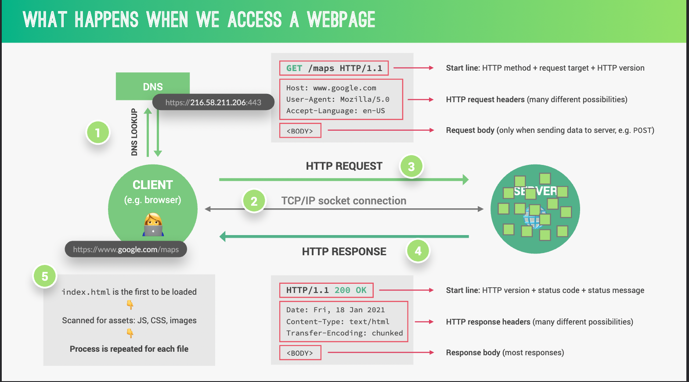
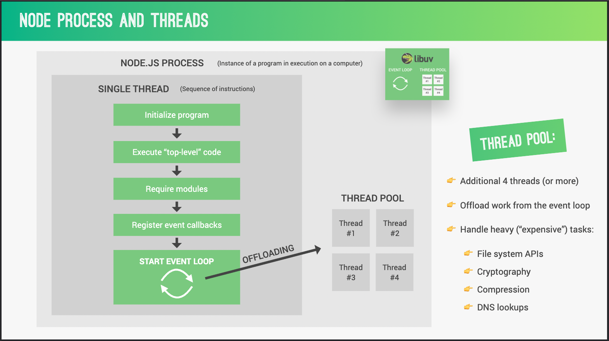
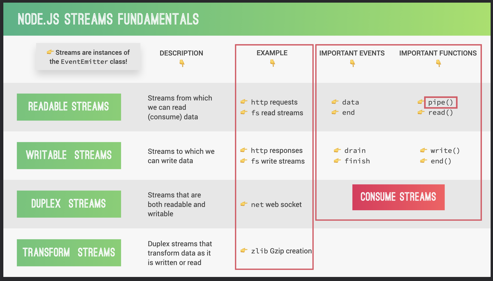
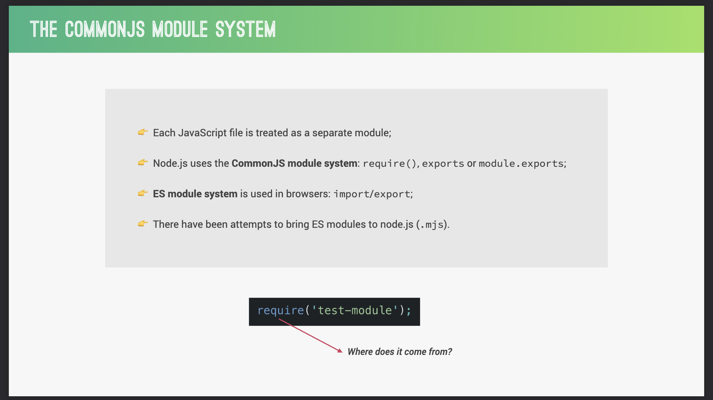
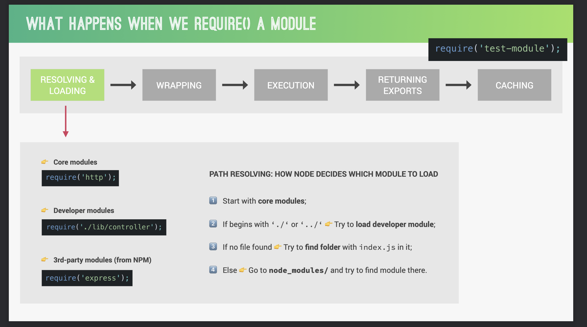
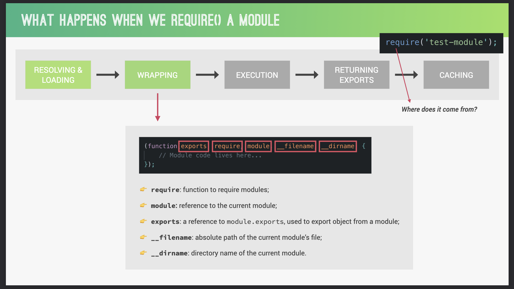
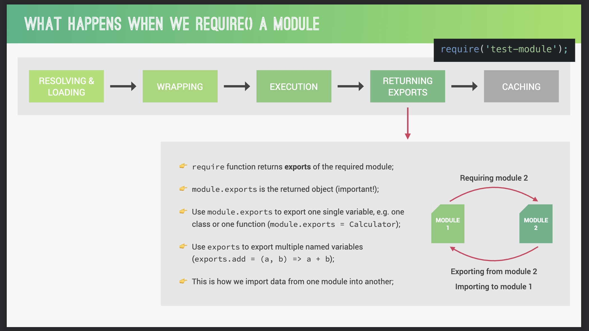
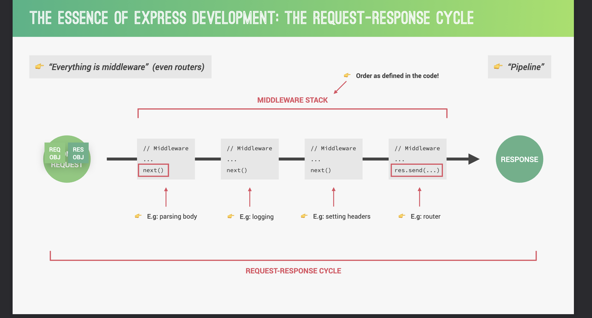

# nodejs-node
学习Nodejs记录

## 1. Node.js介绍
### P8 同步阻塞代码，异步不阻塞代码

### P9 异步读写文件
`readFile()` 和 `writeFile()`具体参数看文档

### P10 创建简单的web服务
- `http.createServer()`：创建一个web服务；  
- `res.end()`：服务器向请求方发送消息；  
- `server.linten()`：启动监听连接的服务器，接收端口、地址、回调函数。

### P11 route路由
通过req.url获取当前用户访问路由页面，展示不同页面信息。  
`req.url`：获取当前用户访问路由页面。  
`res.writeHead`：接收三个参数，状态码、可读的状态消息、`header`响应头。必须在`res.end`之前调用。

### P12 一个简单的API

### P13～14 农场DEMO
1. 读取文件template文件夹下`.html`文件，以字符串形式返回；
2. 遍历循环`data.json`中数据，通过字符串替换形式将替换`tempCard`的占位符。
3. 将`templateOver`文件下占位符用`tempCard`替换。
4. `res.end()`，启动服务，看效果。

### P15 从URL中读取参数
引入`url`模块，版本原因，原视频中`url.parse`方法在我当前的v16.16版本已经废除，使用新语法`new URL`，可以不用引入`url`模块。  

在使用过程中获取`req.protocol`是意外发现是undefined，目前还未找出原因。初步猜测是因为本地服务。文档中表明：
> 分配给 protocol 属性的无效的网址协议值将被忽略.

最后继续使用字符串替换的方法，将找到的`data[id]`替换`templateProduct`中的占位符。

### P16 使用module.exports
将`replaceTemplate()`封装成公用方法，通过modules.exports导出。

### P17 介绍 npm

### P18 dependencies 和 devDependencies
项目依赖和开发依赖的区别，默认安装是项目依赖，--save-dev安装开发依赖。  

如何使用项目中安装的开发依赖，例如nodemon。

### P19 如何引入、使用第三方包

### P20 依赖包版本和更新
`npm outdated`：检查当前项目包版本是否落后；

`package.json`：项目清单。官方介绍：
> https://dev.nodejs.cn/learn/the-package-json-guide/

软件包版本：所有版本都有3个数字，第一个是主版本，第二个是次版本，第三个是补丁版本。
- `~3.1.0`：表示安装`3.1.x`最新版本，单不更新主版本号、次版本号。
- `^3.1.0`：表示安装`3.x.x`最新版本，但不更新主版本号。
- `*3.1.0`：表示安装最新版本，更新主版本号。

`package.json`：跟踪被安装的每个软件包的确切版本，以便产品可以以完全相同的方式被复制。

### P21 VScode配置
prettier 格式化文档

## 2. 网络基础（前后端通信）
### P24 加载web页面都做了哪些事情


### P25 HTTP请求

### P26 前后端对比

### P27 静态页面 动态页面
通过`API`请求

## 3. Node.js原理（理论知识、核心内容）
### P29 Node、chrome V8、Libuv、C++
`Node.js`是基于`chreom V8`和`Libuv`进行封装的一层。

### P30 进程、线程和线程池
`Node.js`单线程。程序初始化时顶层代码会执行，注册必须的模块，然后事件循环开始运行。有些时间太耗时，将会被放入线程池中(图中举例哪种任务是繁重的)。



### P31～32 EventLoop
`process.env.UV_THREADPOOL_SIZE`设置线程池数量，通常默认是4个。

`process.nextTick`回调添加到`process.nextTick.queue`,`Promise.then()`回调添加到`promise microtask queue`。`setTimeout`、`setImmediate`添加到`macrotask queue`中。  

事件循环先执行`process.nextTick queue`中的任务，然后执行`Promise microtask queue`，再执行`macrotask queue`。

#### 参考
- [NodeJs中的事件循环--理解同步于异步编程](https://www.freecodecamp.org/chinese/news/nodejs-eventloop-tutorial/)
- [EventLoop、Timers、Process.nextTick官方文档](https://nodejs.org/en/docs/guides/event-loop-timers-and-nexttick/)
- [EventLoop练习题](https://juejin.cn/post/6844904077537574919)

### P33～34 事件和事件驱动架构
`Node.js`核心API都是围绕异步事件驱动架构构建的，在该架构中，某些类型的对象（“触发器”）触发命名事件。  
所有触发事件的对象都是`EventEmitter`类的实例。这些对象暴露了`eventEmitter.on()`函数，允许将一个或多个函数绑定到对象触发的命名事件。

### P35～36 stream 流


stream类型：
- 可读流：可供读取的数据流，例如http请求、fs读取文件流。
- 可写流：可供写入的数据流，例如http相应、fs写入文件流。
- 双工流：
- 转换流：

读取文件的方式：
- fs.readFile()：缓冲整个文件，如果读取文件大会占用较多内存。
- fs.createReadStream()：on|end，通过将文件拆分成一小块一小块读取，最后读取结束后返回。（从直观效果上来说，我并不觉得和上一种方式有什么区别）。
- fs.createReadStream()：pipe管道方式.

按照作者视频上的讲解，应该第三种方式会很快展示出来，但令我意外的是，无论哪种方式我的电脑都崩溃了😅。

### P37～38 模块引入是如何工作的

每个JS文件都被当成一个单独的模块，NodeJS中使用CommonJS Module导入方式，浏览器中使用ES Module导入方式。也有尝试将ES Module引入到NodeJS中，但不是主流方式。  

当引入一个模块是会发生如下步骤：
#### 解析和加载


  模块被分为三种类型：核心模块，开发者封装模块，第三方引入模块（npm）。
  1. 首先会判断是否为核心模块；
  2. 如果是以./或者../开头的路径，则会尝试去开发者封装的模块下查找；
  3. 如果没找到，会找当前文件夹中的index.js文件；
  4. 如果都不是则会去`node_modules`中查找第三方模块。
 
#### 封装

运行JS文件时，Nodejs会将文件先放入到一个自执行匿名函数（立即执行函数）中，该函数中有五个参数：  

- exports：需要导出的对象；
- require：导入的模块；
- module：
- __fileName：文件名；
- __dirname：目录名；

`console.log(require('module').wrapper)`打印NodeJs用来封装单文件的函数。

#### 执行

#### 返回要导出内容


1. `require`函数返回引入模块中导出的内容;
2. 使用`module.exports`仅可以返回一个对象；
3. 使用`exports`可以返回多个命名变量；

#### 缓存
当导入模块第一次执行后，会被缓存，下次再使用时从缓存中读取。
 
## Promise、Async/Await
### P41 回调嵌套回调所引起的问题
回调地狱

### P42～43 Promise
一个`Promise`是一个代理，代表一个在创建`promise`时不一定已知的值。允许将处理程序与异步操作的最终成功值和失败原因关联起来。使得异步方法可以像同步方法一样返回值：异步方法不会立即返回一个最终值，而是返回一个promise，以便在将来的某个时间点提供值。

```js
const readFilePromise = (path) => {
  new Promise((resolve, reject) => {
    readFile(path, (error, result) => {
      if(err) {
        reject(error)
      } else {
        resolve(result)
      }
    })
  })
}

readFilePromise('./data.txt')
  .then((res) => console.log(res))
  .catch((err) => console.error('读取文件失败'))
```

### P43～44 Async\Await
使用`async`和`await`关键字更简洁写出基于`Promise`的异步行为，无需刻意地链式调用`promise`

返回一个`Promise`  

`async`函数可能包含0个或多个`await`表达式。`await`表达式会暂停整个`async`函数的执行进程并出让其控制权。只有当其等待的基于`promise`的异步函数操作被兑现或被拒绝后才会恢复进程。  
`promise`的解决值会被当作该`await`表达式的返回值。

### P45 Promise.all
`Promise.all()`静态方法接受一个Promise可迭代对象，返回一个`Promise`。当所有输入的`Promise`都被对象，返回的`Promise`也将被兑现，并返回一个包含所有兑现值的数组。  
如果输入的任何`Promise`被拒绝，则返回的`Promise`将被拒绝，并带有第一个被拒绝的原因。

## Express
### P47 Express介绍
### P48 安装Postman
### P49 创建Express和路由
### P50 RESTful API
### P51 创建一个Get请求
### P52 创建一个Post请求
### P53 在请求中携带参数
### P54 创建一个Patch请求
### P55 创建一个Delete请求
### P56 重构路由
### P57 MiddleWare 和 Request-Response Cycle


### P58 创建一个MiddleWare
### P59 引用第三方中间件morgan
安装一个 node.js的http请求记录的中间件。

### P60 创建用户路由
### P61 创建并安装路由
### P62 划分文件目录